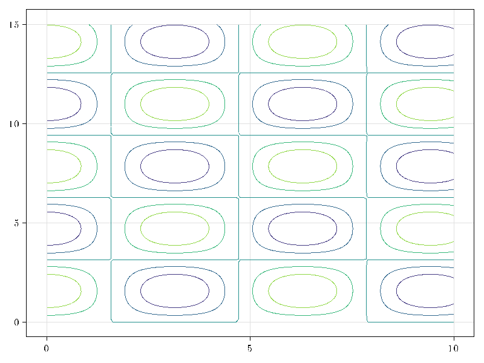
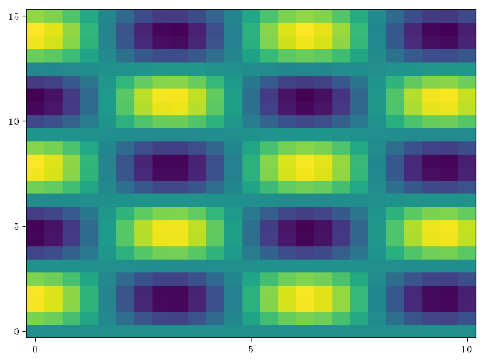
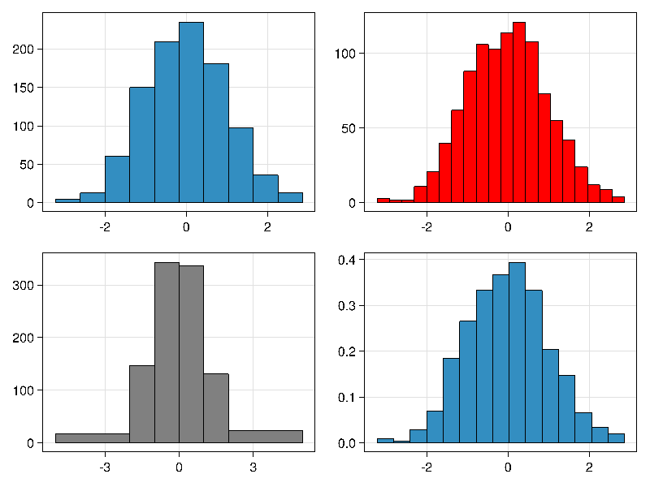
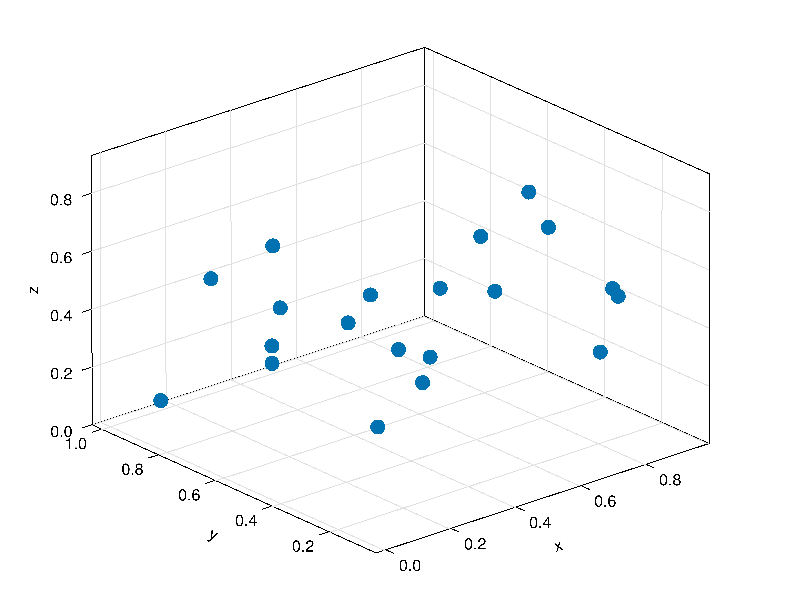
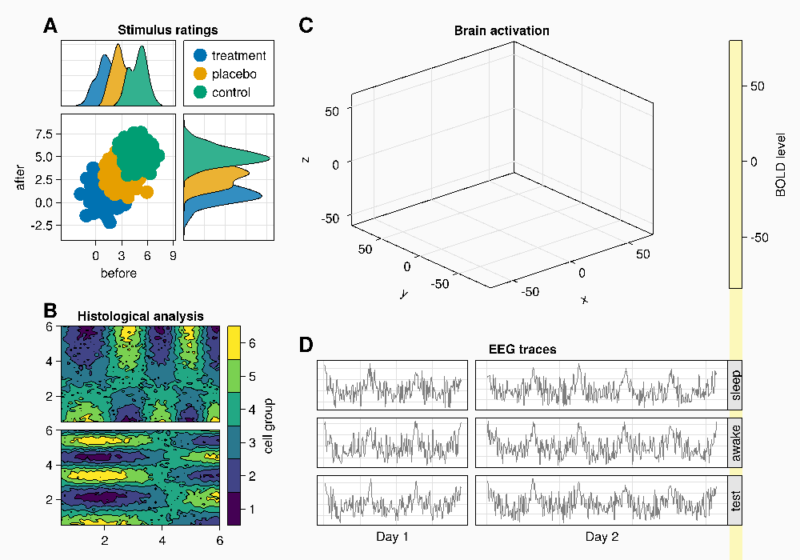

# TaichiMakie

[](https://lucifer1004.github.io/TaichiMakie.jl/stable/)
[](https://lucifer1004.github.io/TaichiMakie.jl/dev/)
[](https://github.com/lucifer1004/TaichiMakie.jl/actions/workflows/CI.yml?query=branch%3Amain)
[](https://codecov.io/gh/lucifer1004/TaichiMakie.jl)

## Usage

Just like any other `Makie.jl` backend, you can simply `using TaichiMakie` and then do plots.

```julia
using TaichiMakie

fig = Figure(resolution = (600, 600))
ax = Axis(fig[1, 1], xlabel = "x", ylabel = "y")
lines!(ax, 1:10, 1:10)
save("test.png", fig)
```

## Gallery

### Contour plot



### Heatmap



### Histogram



### Scatter plot



### Violin plot


### Layout



> This plot contains some bugs.

## Known Issues

- Taichi GGUI does not support the following features:
  - anti-aliasing
  - alpha
- Support for meshes is still erroneous
